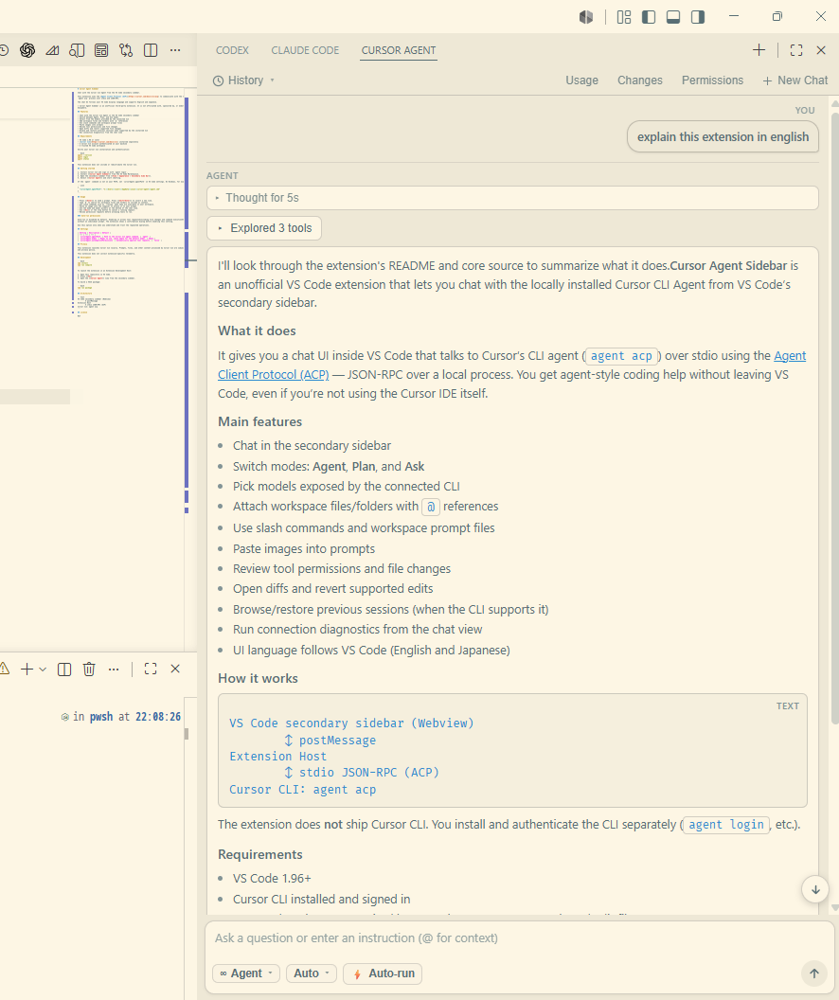

# Cursor Agent Sidebar

Chat with the Cursor CLI Agent from the VS Code secondary sidebar.

This extension uses the [Agent Client Protocol (ACP)](https://cursor.com/docs/cli/acp) to communicate with the locally installed `agent acp` process over stdio and JSON-RPC.

The chat UI follows your VS Code display language and supports English and Japanese.



> Cursor Agent Sidebar is an unofficial third-party extension. It is not affiliated with, sponsored by, or endorsed by Cursor or Anysphere.

## Features

- Chat with the Cursor CLI Agent in the VS Code secondary sidebar
- Switch between Agent, Plan, and Ask modes
- Select from the models provided by the connected CLI
- Add workspace files and folders with `@` references
- Use slash commands and workspace prompt files
- Paste images into prompts
- Review tool permissions and file changes
- Open diffs and revert supported file changes
- Browse and restore previous sessions when supported by the installed CLI
- Run connection diagnostics from the chat view

## Requirements

- VS Code 1.96 or later
- [Cursor CLI](https://cursor.com/docs/cli) installed separately
- A Cursor CLI account authenticated on your machine
- A trusted VS Code workspace

Verify your Cursor CLI installation and authentication:

```bash
agent --version
agent login
agent status
```

This extension does not include or redistribute the Cursor CLI.

## Getting started

1. Install Cursor CLI and sign in with `agent login`.
2. Install **Cursor Agent Sidebar** from the VS Code Marketplace.
3. Open the secondary sidebar from **View > Appearance > Secondary Side Bar**.
4. Select **Cursor Agent** and start chatting.

If the `agent` command is not on your PATH, set `cursorAgent.agentPath` in VS Code settings. On Windows, for example:

```json
{
  "cursorAgent.agentPath": "C:\\Users\\<user>\\AppData\\Local\\cursor-agent\\agent.cmd"
}
```

## Usage

- Press **Enter** to send a prompt. Press **Shift+Enter** to insert a new line.
- Type `@` to search for workspace files and folders to include as context.
- Use slash commands such as `/review` when they are available in your workspace.
- Paste an image into the composer to attach it to your prompt.
- Use the mode and model pickers at the bottom of the chat view.
- Use **Esc** or the stop button to cancel a running request.
- Review permission requests before allowing tools to run.

### Auto-run permissions

Auto-run is disabled by default. Enabling it allows tool requests—including file changes and command execution—to be approved without an individual prompt. The extension shows a confirmation dialog before enabling this setting.

Use this option only when you understand and trust the requested operations.

## Settings

| Setting | Description | Default |
| --- | --- | --- |
| `cursorAgent.agentPath` | Path to the Cursor CLI agent command. | `agent` |
| `cursorAgent.model` | Model to use. Leave empty for the default model. | Empty |
| `cursorAgent.autoApprovePermissions` | Automatically approve tool requests. | `false` |

## Privacy

This extension launches Cursor CLI locally. Prompts, files, and other content processed by Cursor CLI are subject to Cursor's terms and privacy policy.

This extension does not collect extension-specific telemetry.

## Development

```bash
npm install
npm run compile
```

To launch the extension in an Extension Development Host:

1. Open this repository in VS Code.
2. Press **F5**.
3. Open the **Cursor Agent** view from the secondary sidebar.

To build a VSIX package:

```bash
npm run package
```

## Architecture

```text
VS Code secondary sidebar (Webview)
        ↕ postMessage
Extension Host
        ↕ stdio JSON-RPC (ACP)
Cursor CLI: agent acp
```

## License

MIT
